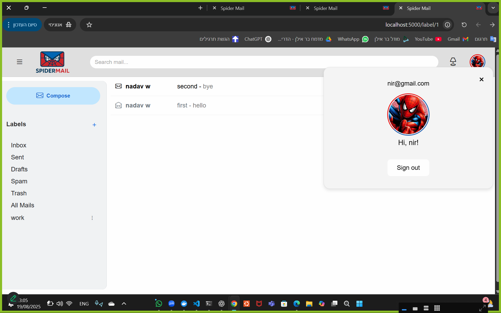

# EX5

Nadav Witman

Nir Gal 

Omer Ahronson

---

# Docker related commands

## Link to run with Android app

For instructions on running the Android client, see the [Link to run with Android app](wiki/Run-Environment.md).

To enable communication between the Node.js backend, the C++ blacklist server, and the React frontend, we created a single Docker Compose setup with three separate containers:

- server2 → C++ blacklist server (port 4000)
- server3 → Node.js backend (port 3000)
- front   → React frontend (port 5000 → 80)
- mongo   → MongoDB database (port 27017, persistent volume: mongo_data)

We also created a Makefile that contains the execution commands.

Note: You need Docker engine installed, version 2+.

Rebuild and start all containers in the background:

With Makefile:

    make run

Without Makefile:

    docker-compose down --remove-orphans
    docker-compose up --build -d

Stop all containers:

With Makefile:

    make stop

Without Makefile:

    docker-compose down

Run the C++ blacklist server with custom arguments:

Default:

    ./server 4000 8 1

Override values (port must remain 4000):

With Makefile:

    make run-server ARGS="4000 <bloom filter arguments>"

Without Makefile:

    docker-compose run --rm server ./server 4000 <bloom filter arguments>

Open a shell inside containers:

C++ server (server2):

With Makefile:

    make server-shell

Without Makefile:

    docker exec -it server2 bash

Node.js backend (server3):

With Makefile:

    make node-shell

Without Makefile:

    docker exec -it server3 bash

React frontend (front):

With Makefile:

    make react-shell

Without Makefile:

    docker exec -it front sh

# SpiderMail App

A modern and user-friendly mail application that allows users to sign up, log in, send and receive emails, and organize them with labels and drafts.  
This project demonstrates authentication, inbox management, and interactive mail features with a clean interface.

---

## Backend (MongoDB)

- The Node.js backend (`server3`) and the C++ server (`server2`) communicate with a MongoDB database (`mongo` service in docker-compose).  
- Connection is configured through the environment variable:  

  CONNECTION_STRING=mongodb://mongo:27017/spider

- We use **Mongoose** to manage (Node.js only):
  * Schemas and validations  
  * Models for users, mails, and labels  
  * Structured database queries  

- MongoDB data is stored in a persistent Docker volume (`mongo_data`), so information is preserved even if the containers are stopped or rebuilt.

---

## Routes

### Home Page 
- Displays the website name.
- Navigate to **Sign Up** or **Log In**.

---

### Sign Up Page
- Required fields:
  - Unique username (validated with Gmail-style regex format).
  - First name and last name.
  - Password & confirm password (minimum 8 characters, at least one letter, one number, and one special character).
  - Date of birth.
  - Gender (male/female/other).
- Optional: Profile picture.

---

### Login Page
- Enter username and password to access your account.

---

### Inbox
- Displays the **last 50 received emails**.
- Different display for read and unread mail.  
- Labels:
  - Emails can be **added to multiple labels** (e.g., Work, Personal).
  - Labels can be renamed or removed.
  - Emails can be filtered by label.

---

## Important Components

### Sidebar
The sidebar provides access to all your email folders and features:
- Inbox → All received emails.
- Sent → All sent emails.
- Drafts → Saved emails not yet sent.  
  * If a draft is empty it will be deleted.  
  * You can continue writing the draft by clicking on it and then send it.  
- Spam → Emails flagged as spam or blacklisted.  
  * If you add a mail to spam, all links are marked as blacklisted.  
  * If you remove a mail from spam, all links are marked as not blacklisted.  
  * If a mail appears in spam, it will not appear in other labels.  
- Trash → Deleted emails.  
  * If a mail appears in trash, it will not appear in other labels.  
  * If you delete a mail from trash, it will be removed permanently.  
- All Mails → Displays all emails (include spam and trash).
- Compose → Write a new email.
- Labels → Add, remove, or rename labels.

---

### Header
- Profile picture → Click to open menu with **logout** option.
  * If there is no profile picture, generate random color with the first letter of the first name.
- Dark/Light mode toggle.
- Sidebar toggle button.
- Search bar for filtering emails by keywords.

---

### Compose Mail
- Fields:
  - Recipients → Supports multiple recipients, validated with regex (must have at least one recipient if you send).
  - Subject.
  - Body.
  - Attachments (files and images).
- Drafts → If not sent, emails are saved as drafts automatically.
- Scheduled sending → Option to send later.
- If you click on trash, the email will not be saved as a draft.  

#### Tag Logic (Labels & Recipient Detection)
- When typing a recipient:
  - If the username exists in the system → it will **generate a visual tag** with the user’s name.
  - Hover on the tag shows **basic profile info** (e.g., full name, email, avatar).

---

### Single Mail View
- Open an email to:
  - Read content.
  - Reply, forward, or delete.
    * When an email is replied to, only the last email in the thread is shown.
  - Remove labels.
- Organize the email from this view.

---
