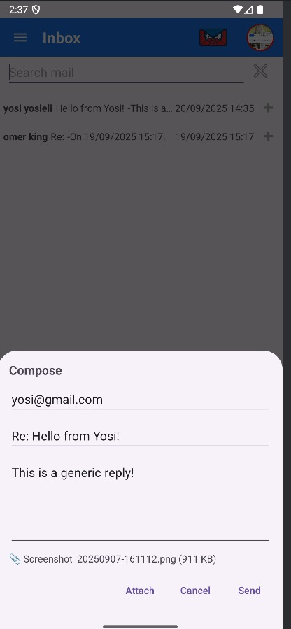
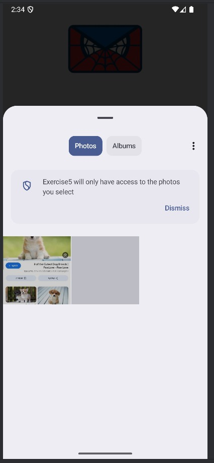

# Compose Mail (Android)

- Recipients: must enter at least one.
- Subject and body fields.
- Attachments: files and images.
- Drafts are auto-saved.

## Links to each page
[Home Page](Home-Page.md)  
[Sign Up](Sign-Up-Page.md)  
[Login](Login-Page.md)  
[Inbox](Inbox.md)  
[Sidebar](Sidebar.md)  
[Header](Header.md)  
[Compose Mail](Compose-Mail.md)  
[Single Mail View](Single-Mail-View.md)  
[Run Environment](Run-Environment.md)

