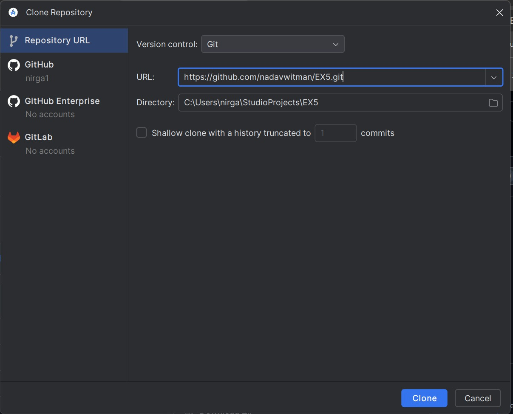
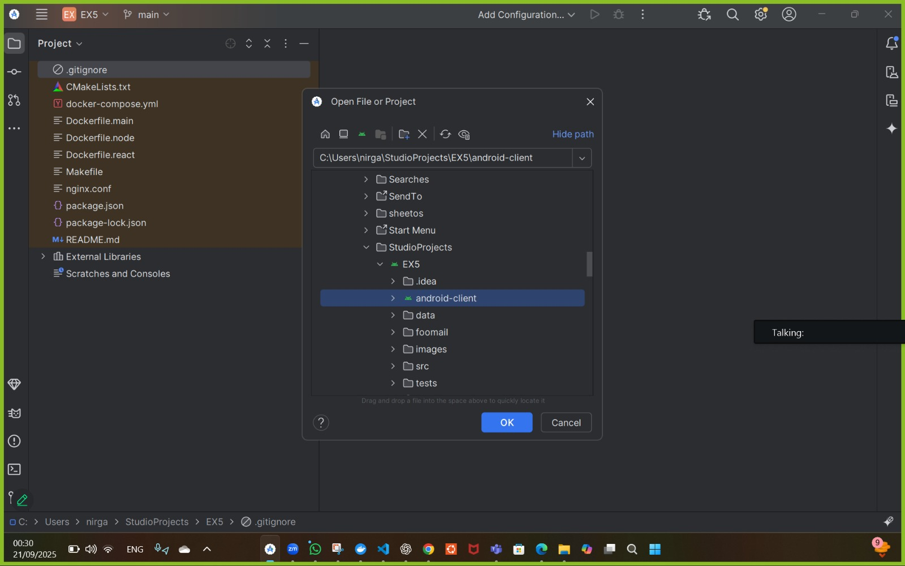
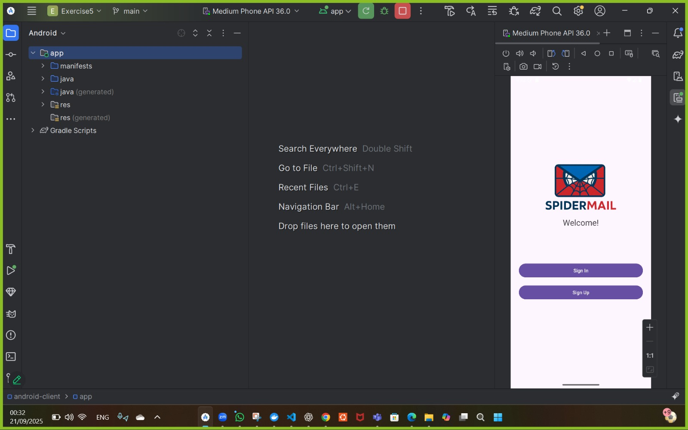

# Run Environment (Android)

## Running all servers
in vs code:

    make run

Alternative:

    docker-compose down --remove-orphans
    docker-compose up --build -d

## Links to each page
[Home Page](Home-Page.md)  
[Sign Up](Sign-Up-Page.md)  
[Login](Login-Page.md)  
[Inbox](Inbox.md)  
[Sidebar](Sidebar.md)  
[Header](Header.md)  
[Compose Mail](Compose-Mail.md)  
[Single Mail View](Single-Mail-View.md)  
[Run Environment](Run-Environment.md)

## Running Android
### 1. Open Android Studio.
### 2. Choose clone repository.

### 3. Insert the url:

    https://github.com/nadavwitman/EX5.git

### 4. Press on EX5 --> open --> android-client.

### 5. Start the emulator.

